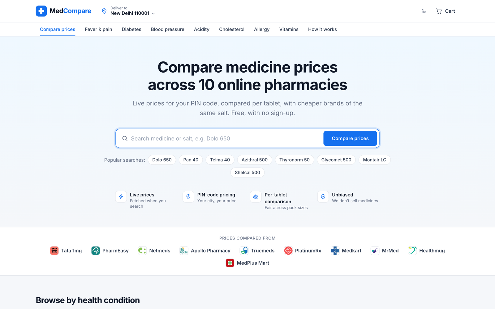
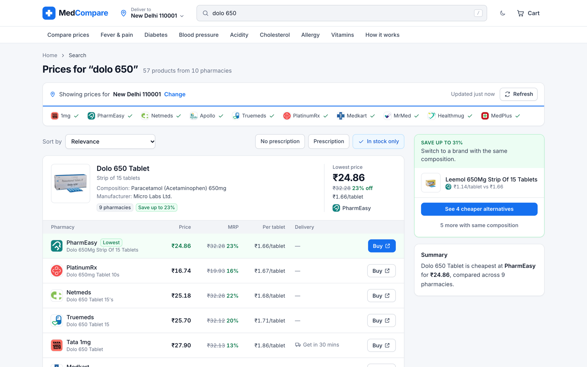
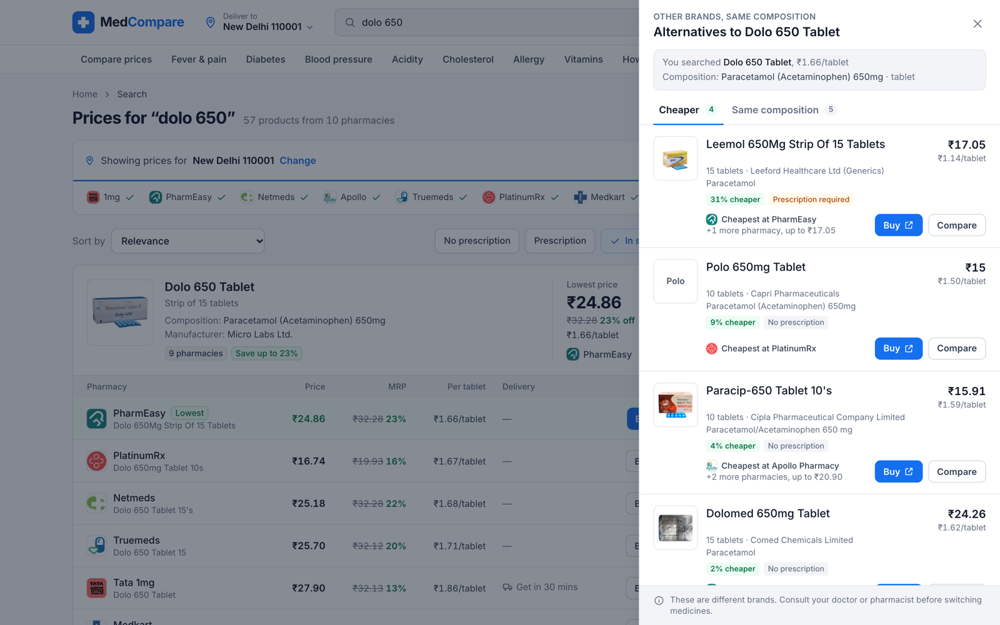
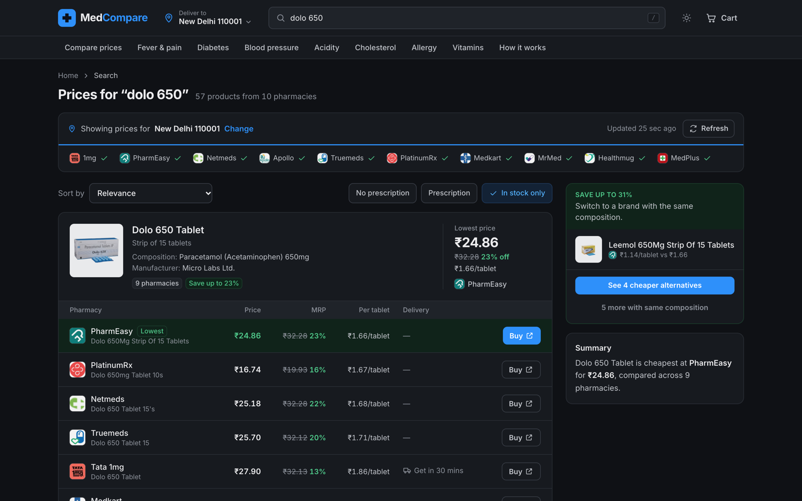
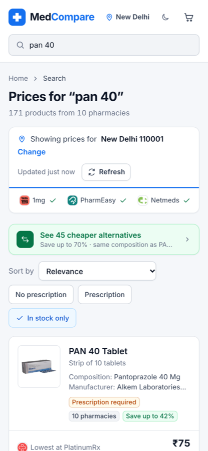

<div align="center">

# MedCompare

**Live medicine price comparison across 10 Indian online pharmacies, priced for your PIN code.**

Search once, see every pharmacy's price side by side, compare fairly per tablet, and find cheaper brands with the same composition.

<p><a href="https://mymedcompare.vercel.app"></a></p>

<p>


</p>



</div>

## Contents

- [Features](#features)
- [Screenshots](#screenshots)
- [Pharmacies covered](#pharmacies-covered)
- [Getting started](#getting-started)
- [How it works](#how-it-works)
- [Project structure](#project-structure)
- [API](#api)
- [Testing](#testing)
- [Adding or fixing a pharmacy](#adding-or-fixing-a-pharmacy)
- [Deployment](#deployment)
- [Disclaimer](#disclaimer)
- [License](#license)

## Features

- **Live prices from 10 pharmacies.** Every search queries all pharmacies in parallel. Results stream in as each one answers, with a per-pharmacy status bar (loaded, no match, unavailable).
- **Location-aware.** Prices follow your PIN code or city (Tata 1mg by city, Apollo by PIN). Set it by PIN, by browser geolocation or from city presets.
- **One row per medicine.** Listings for the same brand, strength, form and pack are grouped across pharmacies into a single comparison table, sorted cheapest first.
- **Fair per-unit pricing.** Pack sizes are parsed (strip of 10 vs 15, 100 ml, etc.), so every offer also shows price per tablet, capsule or ml.
- **Cheaper alternatives.** Other brands with the identical salt, strength and form, in a separate drawer with two tabs: *Cheaper* and *Same composition*. Each shows the photo, manufacturer, prescription status, cheapest pharmacy and a direct buy link.
- **Cart and basket optimiser.** Add medicines to a cart and see the best single pharmacy for the whole basket plus the cheapest split across pharmacies, normalised for pack size.
- **Fast search UX.** Type-ahead suggestions, recent searches (remove one, or clear all), keyboard navigation, filters (prescription / no prescription, in stock), sorting.
- **Light and dark themes.** Light by default; dark is opt-in and remembered.
- **No hard-coded data.** No medicine or price data lives in the code. Everything is fetched live and cached briefly.
- **Zero running cost.** No database, no API keys, no paid services.

## Screenshots

| Search results | Alternatives drawer |
|---|---|
|  |  |

| Dark mode | Mobile |
|---|---|
|  |  |

## Pharmacies covered

| Pharmacy | Pricing | Source |
|---|---|---|
| Tata 1mg | By city | Search API (`x-city` header) |
| Apollo Pharmacy | By PIN code | Search API with an anonymous, auto-refreshed public token |
| PharmEasy | National | Type-ahead API for products, product page data for prices |
| Netmeds | National | Storefront search API (site's public app key) |
| Truemeds | National | Search-suggestion API |
| PlatinumRx | National | Search API |
| Medkart | National | Search API |
| MrMed | National | Search API |
| Healthmug | National | Search API |
| MedPlus Mart | National | Search API |

These are the pharmacies' own web APIs, called the same way their websites call them for a logged-out visitor. MedCompare does not solve CAPTCHAs, forge signed tokens, reuse logged-in sessions or bypass bot protection.

## Getting started

> These instructions are for the author and for people with written permission. See [License](#license).

**Requirements:** Node.js 22 or newer (tested on Node 24) and npm.

```bash
git clone https://github.com/shahidthisside/MedCompare.git
cd MedCompare/apps/web
npm install
npm run dev        # http://localhost:3000
```

| Command (in `apps/web`) | What it does |
|---|---|
| `npm run dev` | Start the dev server |
| `npm run build && npm start` | Production build and server |
| `npm test` | Unit and fixture tests (Vitest) |
| `npm run typecheck` | TypeScript check |
| `npm run probe -- "dolo 650" 400001 Mumbai` | Live-check every pharmacy API from the terminal |

No environment variables are required.

## How it works

```text
Browser ──(10 parallel requests)──▶ /api/search/[source] ──▶ pharmacy API
   │                                 zod validation · 8 s timeout
   │                                 10-min cache per source + query + location
   │                                 request de-duplication · per-IP rate limit
   ├──▶ /api/suggest?q=     type-ahead (1mg + Medkart, cached 1 h)
   ├──▶ /api/location       India Post PIN lookup / OpenStreetMap reverse geocoding
   └──  in the browser: grouping, per-unit prices, substitutes, cart optimiser
```

1. **Adapters** (`src/lib/sources/adapters.ts`): one per pharmacy. Each has a `fetch(query, location)` that builds the request and a pure `parse(json)` that maps the response to a common `Listing` (price and MRP in paise, pack size, unit type, composition, manufacturer, stock, prescription flag, image, product URL).
2. **API route** (`src/app/api/search/[source]/route.ts`): runs one adapter server-side, so the browser never talks to pharmacies directly. Responses are cached and rate-limited.
3. **Matching** (`src/lib/match.ts`): groups listings into products by brand, strength, form and pack, picks the best title, image and composition across sources, and finds substitutes by a normalised composition key.
4. **UI**: React client components render results as each source finishes.

## Project structure

```text
MedCompare/
├── apps/web/                    Next.js app (UI + API routes)
│   ├── src/app/                 Pages: home, search, cart, about; API routes
│   ├── src/components/          Header, search box, product card, alternatives drawer…
│   ├── src/lib/
│   │   ├── sources/             Pharmacy metadata, adapters, captured fixtures
│   │   ├── server/cache.ts      TTL cache, rate limiter, single-flight
│   │   ├── match.ts             Grouping, composition keys, substitutes
│   │   ├── parse.ts             Price, pack size, strength and form parsing
│   │   ├── cart.tsx             Cart state and basket optimiser
│   │   └── location.tsx         Location state (PIN / geolocation)
│   ├── public/logos/            Pharmacy logos
│   └── scripts/                 probe.ts (live check), capture.ts (save fixtures)
├── tools/endpoint-discovery/    Playwright tool that finds and minimises pharmacy search APIs
└── docs/                        Architecture, data sources, design, decisions, roadmap
```

## API

All routes are public, read-only `GET` endpoints.

| Route | Parameters | Returns |
|---|---|---|
| `/api/search/{source}` | `q` (2–80 chars), `pin` (6 digits), `city` | `{ source, ok, listings[], error?, tookMs, fetchedAt, cached? }` for one pharmacy |
| `/api/suggest` | `q` (2–60 chars) | `{ q, suggestions: [{ name, composition? }] }`, up to 8 |
| `/api/location` | `pin`, or `lat` + `lng` | `{ pin, city, district, state }` |

`{source}` is one of `tata1mg`, `pharmeasy`, `netmeds`, `apollo`, `truemeds`, `platinumrx`, `medkart`, `mrmed`, `healthmug`, `medplus`.

## Testing

```bash
cd apps/web
npm test
```

- **Parser and matching tests:** price, pack-size, strength and form parsing; grouping; substitutes; placeholder image detection.
- **Adapter fixture tests:** every adapter is tested against a real captured response in `src/lib/sources/__fixtures__/`, so parser changes are checked without network access.
- **Cart tests:** best single pharmacy and cheapest split, with pack-size normalisation.
- **Live probe:** `npm run probe` calls every pharmacy and reports item counts and timings, to catch upstream API changes.

## Adding or fixing a pharmacy

1. Find the site's search API with `tools/endpoint-discovery/` (`node discover.mjs --only <site>`), or paste a DevTools cURL into `node test-curl.mjs`.
2. Save a real response as `apps/web/src/lib/sources/__fixtures__/<id>.json` (`scripts/capture.ts` can do this).
3. Add the pharmacy to `src/lib/sources/meta.ts` and an adapter to `adapters.ts`.
4. Add fixture assertions to `adapters.test.ts`, then run `npm test` and `npm run probe`.

Research notes for each source are in [`docs/DATA_SOURCES.md`](docs/DATA_SOURCES.md).

## Deployment

The live site, **[mymedcompare.vercel.app](https://mymedcompare.vercel.app)**, runs on Vercel with server functions in Mumbai (`bom1`, see `apps/web/vercel.json`). Every push to `main` deploys automatically; other branches get preview URLs.

MedCompare is a standard Next.js app and runs on any Node.js 22+ host (`npm run build && npm start`). Things to know:

- Caching and rate limiting are in memory, per server instance. For several instances, move them to a shared store such as Redis.
- The API routes have no authentication but are rate-limited per IP. Behind a proxy or CDN, make sure `x-forwarded-for` is set by the proxy, not the client.
- Some pharmacies may treat datacenter IPs differently from home connections. Run `npm run probe` from the host after deploying.

## Disclaimer

- MedCompare is a price comparison service. It does not sell medicines or give medical advice. Always consult a doctor or pharmacist before switching medicines.
- Prices are what each pharmacy shows a logged-out visitor and may change at checkout (coupons, memberships, delivery fees).
- Pharmacy APIs are private and can change without notice; `npm run probe` shows which ones are affected.
- Pharmacy names and logos belong to their respective owners. MedCompare is not affiliated with any of them.

## License

**Copyright © 2026 Shahid Ansari. All rights reserved.**

MedCompare is **not open source**. The code is public for viewing only. Without written permission you may not copy, modify, rebrand, redistribute, deploy or present any part of it as your own, and you may not use it to train or feed AI models. Forks give no extra rights. See [LICENSE](LICENSE) for the full terms.

To ask for permission, contact [heyshahid786@gmail.com](mailto:heyshahid786@gmail.com).
